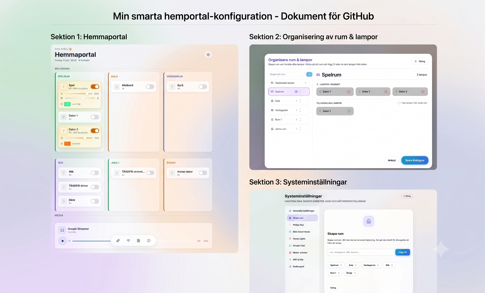

# Lokal Standalone Gästportal för Smart Hem-belysning (Beta 0.1)



Detta projekt är en helt **fristående, lokal och responsiv gästportal** för smart hem-belysning och mediaspelare. Den kommunicerar direkt med dina fysiska broar (Philips Hue, IKEA, Govee, Matter och Google Cast) över det lokala nätverket – **helt utan externa smarta hem-plattformar som Home Assistant**.

---

## Huvudfunktioner

1. **Mobil-, Foldable- och Desktop-anpassad**:
   - En modern, responsiv layout för desktop/smartphone/foldables/tablets.
   
2. **Inställningshubb & Adminpanel**:
   - Öppnas via kugghjulet (`⚙️ Ändra rum`) i sidhuvudet.
   - **Organisera rum (Kanban Sorterare)**: Skapa nya rum och placera dina lampor i rätt rum. Stöder både drag-and-drop (med muspekare) och en touch-vänlig rullgardinsmeny på mobiler.
   - **Konfigurera enheter**: Kör om installationsguiden utan att skriva över befintliga inställningar (redigeringsläge).

3. **Dynamisk Installationsguide (Setup Wizard)**:
   - Vid första start (eller vid omkonfiguration) guidas du igenom parning av dina enheter.
   - **Tjänsteurval**: Bocka i precis vilka system du äger (Hue, IKEA, Govee, Cast, Matter) – guiden hoppar automatiskt över steg för oanvända tjänster, och progress-mätaren anpassas automatiskt.
   - **Realtids Sök igen-funktion**: Skanna av broar igen med ett klick via `🔄 Sök igen`-knappen för att hämta nyanslutna lampor utan att starta om.
   - **Smart Plugs & Uttag**: Hittar och styr både lampor, LED-drivers och smarta eluttag (t.ex. IKEA dirigera smart plugs och Matter plugs) på samma gång.

4. **Direct Bridge-integrationer (100% lokala nätverksbroar)**:
   - **Matter-enheter (Lokal)**: Inbyggd lokal Matter-commissioner och Controller (använder `@project-chip/matter.js`). Söker upp oparade enheter via mDNS (`_matterc._udp`) och kan para med Matter-koder också.
   - **Philips Hue**: Direkt kommunikation med Hue Bridge v2, med realtidsuppdateringar via Server-Sent Events (SSE).
   - **IKEA Smart Home**: Fullt stöd för både nya **Dirigera Hub** (lokalt REST API med PKCE) och äldre **Trådfri Gateway** (CoAP/DTLS), inklusive eluttag.
   - **Govee Lights**: Stöd för Govees moderna **Cloud OpenAPI** samt det äldre **Developer API** (väljs automatiskt baserat på API-nyckeln). Inkluderar fullt stöd för färgväljare och färgtemperaturreglering samt automatisk modellidentifiering.
   - **Google Cast**: TLS-socketstyrning av Google Streamers, Chromecasts och smarta högtalare direkt över port 8009. *EJ TESTAT*

---

## Säkerhet & GitHub-privacy

Projektet är konfigurerat för att hålla dina privata uppgifter helt skyddade. Följande filer och mappar ingår i [`.gitignore`](.gitignore) och laddas **aldrig** upp eller delas vid uppladdning till GIT:
* `runtime-config.json` – Lagrar dina lokala bridge-API-nycklar, rumsuppdelningar och WiFi-lösenord.
* `server/data/` – Lagrar dina lokala Matter-enheters fabric-koder, anslutningsmetadata och krypteringsnycklar.
* `.env` – Eventuella lokala miljövariabler.
* `gastportal_qr.png` & `gastportal_kort.html` – Genererade utskriftskort till dina gäster.

---

## Kom igång

### Systemkrav
- Node.js (v18 eller senare)
- Enheter anslutna på samma lokala nätverk (LAN)

### 1. Installation
Navigera till projektets rotkatalog och installera alla beroenden för både server och frontend:
```bash
npm run install:all
```

### 2. Starta Utvecklingsservern
Kör servern och frontenden samtidigt i utvecklingsläge:
```bash
npm run dev
```
- **Backend-servern** startar på http://localhost:3001
- **Frontend-klienten (Vite)** startar på http://localhost:5173

Öppna http://localhost:5173 i din webbläsare för att starta den interaktiva installationsguiden!

### 3. Bygga för Produktion
För att kompilera och optimera frontenden för snabbast möjliga laddtid i produktion:
```bash
npm run build
```
Starta sedan produktionsservern:
```bash
npm run start
```
Portalen körs då på http://localhost:3001.

### 4. Generera Kodbasgraf (Visualisering)
För att generera en interaktiv grafisk visualisering av projektets kodarkitektur och anslutningar:
```bash
npm run graphify
```
Detta skapar mappen `graphify-out/` med filen `graph.html`. När Express-servern körs kan grafen ses i en webbläsare via portalens inställningsmeny eller direkt på http://localhost:3001/code-graph.

---

## Projektstruktur
- `server/`: Backend-kärnan i Node.js Express.
  - `server/bridges/`: Drivrutiner för enhetsbroarna (`hue.js`, `ikea.js`, `govee.js`, `matter.js`, `cast.js`).
  - `server/setup.js`: API-routerna för parning, testning och resursavsökning.
  - `server/runtimeConfig.js`: Säker hantering av `runtime-config.json` (skapas lokalt vid setup).
  - `server/data/`: Lokal databas för Matter-anslutningar (ignorerad av Git).
- `client/`: React-frontend byggd med Vite.
  - `client/src/components/setup/`: Den interaktiva installationsguiden.
  - `client/src/components/RoomOrganizer.jsx`: Kanban-sorteraren för rum.
  - `client/src/index.css`: Glassmorphism-designsystemet.
- `graphify/`: Python-modulen för Graphify (verktyg för kodbas-visualisering).
- `graphify-out/`: Genererade filer för visualisering (ignorerad av Git).
- `.agents/`: AI-agentens lokala regler och workflows för Graphify-integreringen.
