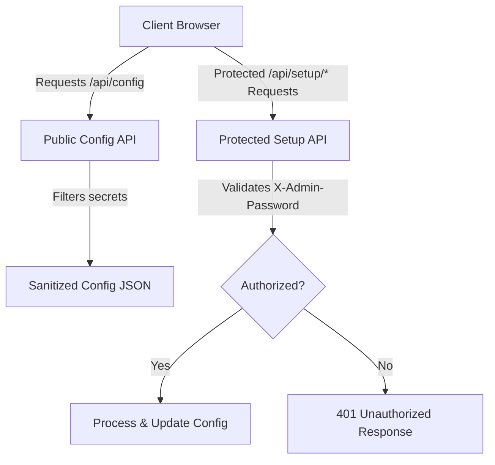

# Security Architecture & Approach

This document outlines the security model, trust assumptions, and engineering approach implemented in **Frassins Guest Portal** to protect configurations and access rights.

## 1. Trust Model & Scope

The portal is specifically designed to run as a **local-only home automation hub**.
* **Zero External Cloud Dependency (by default)**: With the exception of the Govee Cloud API (which requires an optional user-provided cloud API key), all integrations (Philips Hue, IKEA Dirigera/Trådfri, Google Cast, Matter) are controlled directly over the Local Area Network (LAN).
* **Network Isolation**: The application assumes it runs behind a trusted home firewall. Access control focuses on preventing guests on the local WiFi from tampering with bridge settings, credentials, or system settings, while still allowing them to control lights, media players, and organize layouts.

---

## 2. Authentication & Access Control

To restrict configuration access to administrators, we employ a passcode security system:

### Admin Passcode Security
* **Protected Routes**: All administrative endpoints (`/api/setup/*` except for public helper routes) require the client to supply an `X-Admin-Password` header.
* **Passcode Resolution**: The backend resolves the expected administrator passcode using the following priority order:
  1. `adminPassword` defined dynamically by the administrator inside `runtime-config.json`
  2. `ADMIN_PASSWORD` defined in the system `.env` file
  3. Default passcode fallback: `1234`
* **Session Storage**: Client-side authentication tokens are cached in the browser's `sessionStorage` (in memory) to prevent leakage to persistent storage.

### Role Separation (Guests vs. Administrators)
* **Administrative Operations**: Configuring Hue bridges, pairing Matter nodes, setting up IKEA tokens, or performing factory resets require authentication.
* **Guest Operations**: Guests are allowed to control light states (on/off, brightness, color) and organize room layouts.
* **Dedicated Save Route**: To support guest room-remapping without exposing administrative permissions, we expose a scoped endpoint: `POST /api/setup/save-rooms`. This public endpoint accepts only room list updates and light-to-room mappings, rejecting any changes to bridge integration keys or gateway IP configurations.

---

## 3. Credential & Secret Management

* **Config Sanitation & Zero Passcode Exposure**: The main configuration file `runtime-config.json` stores local credentials (API tokens, Matter node parameters, Hue API keys). However:
  - When clients request the configuration via `/api/config` or `/api/setup/config` (even when logged in), the backend automatically purges the `adminPassword` and all gateway API keys before responding. The administrative password is **never** transmitted to the browser in any API response.
  - The public `/api/setup/status` endpoint checks password safety on the server and only exposes a secure boolean flag (`isDefaultPassword`), preventing password leakage while allowing the UI to conditionally toggle helper prompts.
* **In-Memory Session Caching**: Once verified, the administrative passcode is stored solely in the browser's volatile `sessionStorage`. It is kept in transient tab memory and is completely cleared upon closing the browser tab or clicking the "Logga ut" (Log Out) button, rather than being cached in cookies or persistent storage like `localStorage`.
* **No Hardcoded Secrets**: Developers must not commit secrets to source code. Local credentials must be generated dynamically during the Setup Wizard or supplied via local environment variables. The compiled client Javascript bundles contain no passwords or secrets.

---

## 4. Local TLS & Gateway Trust

* **Self-Signed Certificates**: Local gateways (such as IKEA Dirigera or Google Cast devices) communicate over TLS using self-signed or local-trust certificates.
* **LAN SSL Policy**: To avoid complex certificate enrollment procedures on a local home network (where standard HTTPS domain verification is not feasible), the portal permits `rejectUnauthorized: false` for internal LAN connections. This ensures smooth direct control of devices without introducing certificate renewal overhead.

---

## 5. Security Recommendations for Deployments

If you deploy this portal in your home, follow these best practices:
1. **Change the Default Passcode**: Immediately update the admin passcode from `1234` to a strong unique passcode via the **Konto** (Account) tab in the Setup Wizard.
2. **Isolate Guest WiFi**: Keep guests on a separate guest network segment and use firewall rules (or a reverse proxy) to grant them access only to the portal's client dashboard port, preventing access to host admin ports.
3. **Internal SSL**: If exposing this portal outside your home network, serve it behind a reverse proxy (e.g. Nginx, Caddy, Traefik) configured with a valid Let's Encrypt SSL certificate.
