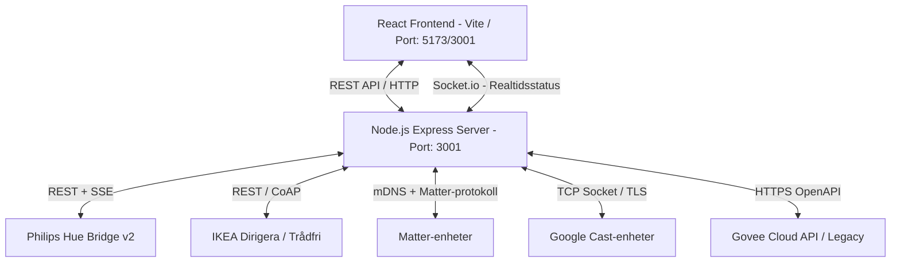
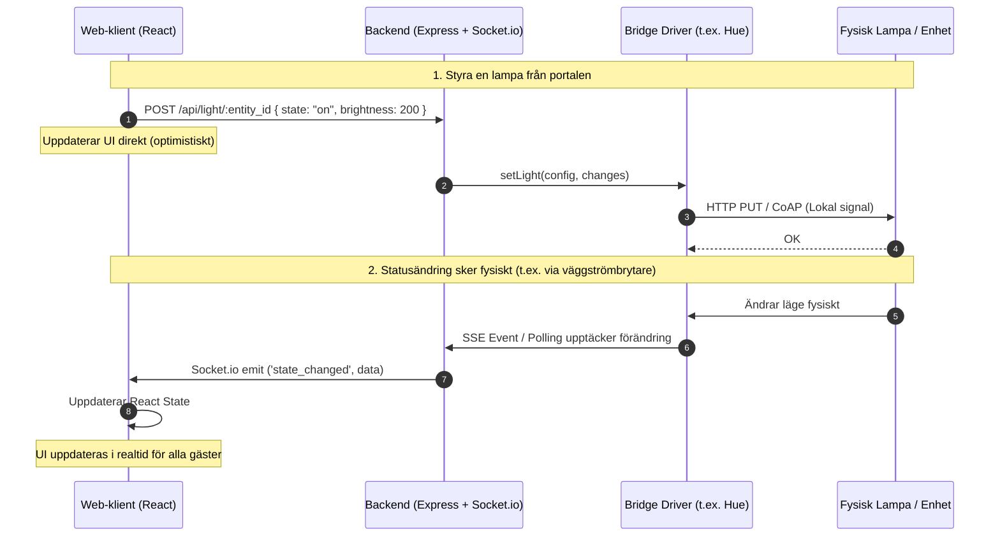

# Agent-guide: Arkitektur, Funktioner och Processer

Denna fil (`agent.md`) är skapad för att ge andra AI-agenter och utvecklare en snabb och djupgående förståelse för projektets arkitektur, funktioner, informationsflöden och kodstruktur.

---

## 1. Projektöversikt
Detta projekt är en helt **fristående, lokal och responsiv gästportal** för smart hem-belysning och mediaspelare. Portalen kommunicerar direkt med fysiska broar/enheter på det lokala nätverket (LAN) – **helt utan externa smarta hem-plattformar som Home Assistant eller molnberoenden** (förutom Govee Cloud API).

---

## 2. Systemarkitektur & Teknikstack

Systemet är uppdelat i en React-frontend (klient) och en Node.js-backend (server) som kommunicerar via ett REST-API samt realtids-WebSockets (Socket.io).

### Frontend (Klient)
- **Teknik**: React, Vite, CSS (vanilj med CSS-variabler).
- **Designmönster**: Glassmorphism (semi-transparenta ytor, suddiga bakgrunder, mjuka skuggor).
- **Huvudkomponenter**:
  - [App.jsx](file:///Users/tobias/Documents/Egna%20projekt/Home%20Automation/client/src/App.jsx): Central hantering av applikationstillstånd (state), Socket.io-anslutning, samt popover-menyer (scener, wifi, anteckningar, systemstatus).
  - [SetupWizard.jsx](file:///Users/tobias/Documents/Egna%20projekt/Home%20Automation/client/src/components/setup/SetupWizard.jsx): En flerstegsguide för att konfigurera och para alla smarta enheter vid första uppstart (eller ändra inställningar i efterhand).
  - [RoomOrganizer.jsx](file:///Users/tobias/Documents/Egna%20projekt/Home%20Automation/client/src/components/RoomOrganizer.jsx): Kanban-tavla där administratören kan skapa rum och sortera lampor via drag-and-drop eller rullgardinsmenyer.

### Backend (Server)
- **Teknik**: Node.js, Express, Socket.io, Undici (för HTTP-anrop med anpassad TLS/agent-konfiguration).
- **Struktur**:
  - [index.js](file:///Users/tobias/Documents/Egna%20projekt/Home%20Automation/server/index.js): Serverns startpunkt. Ansvarar för Express-servern, Socket.io, lazy loading av drivrutiner (bridges) och vidarebefordran av statusändringar. Exponerar även endpointen `/code-graph` (och `/graphify-out`) för att serva den interaktiva visualiseringen av projektets kodarkitektur (genererad via Graphify).
  - [setup.js](file:///Users/tobias/Documents/Egna%20projekt/Home%20Automation/server/setup.js): Router med endpoints för att upptäcka, testa och driftsätta (para) enheter under installationsprocessen.
  - [runtimeConfig.js](file:///Users/tobias/Documents/Egna%20projekt/Home%20Automation/server/runtimeConfig.js): Läser och skriver till den lokala konfigurationsfilen `runtime-config.json`.

---

## 3. Konfigurations- & Säkerhetshantering

För att skydda användarnas personliga uppgifter och nätverksuppgifter är all känslig och lokal information exkluderad från Git:
- **`runtime-config.json`**: Skapas dynamiskt i projektets rot efter att installationsguiden slutförts. Innehåller API-nycklar, IP-adresser, WiFi-lösenord, rumsindelningar, lampor och gästanteckningar.
- **`server/data/matter-store/`**: Lokal databas som lagrar kryptonycklar och driftsättningsdata (Fabric-info) för Matter-enheter.
- **`.env`**: Valfria lokala miljövariabler (t.ex. anpassad `PORT` eller `CONFIG_PATH`).

> [!WARNING]
> Modifiera aldrig `runtime-config.json` eller filer i `server/data/` direkt i källkoden eller under Git-commits. Dessa filer ligger i `.gitignore`.

---

## 4. Bridge-integrationer (Drivrutiner)

Varje smarta hem-system har en egen drivrutin i mappen [server/bridges/](file:///Users/tobias/Documents/Egna%20projekt/Home%20Automation/server/bridges/). Alla bridges implementerar ett liknande gränssnitt:
- `getStates(deviceConfigs)`: Hämtar aktuellt tillstånd (på/av, ljusstyrka, färgtemperatur) för en uppsättning enheter.
- `setLight(deviceConfig, changes)` / `setMedia(deviceConfig, changes)`: Styr en enskild enhet.
- `startRealtime(io, deviceConfigs)`: Startar lyssnare/polling för att pusha statusändringar till klienterna via Socket.io.
- `destroy()`: Stänger ner sockets, prenumerationer och timers (används när konfigurationen laddas om).

### De specifika drivrutinerna:
1. **Philips Hue ([hue.js](file:///Users/tobias/Documents/Egna%20projekt/Home%20Automation/server/bridges/hue.js))**:
   - Kommunicerar med Hue Bridge v2 över HTTPS.
   - Använder Server-Sent Events (SSE) på `/eventstream/clip/v2` för att ta emot statusändringar i realtid utan fördröjning.
2. **IKEA Smart Home ([ikea.js](file:///Users/tobias/Documents/Egna%20projekt/Home%20Automation/server/bridges/ikea.js))**:
   - **Dirigera Hub**: Lokalt REST-API över HTTPS med Bearer-token (genererat via OAuth/PKCE vid parning). Använder SSE för realtidsstatus.
   - **Trådfri Gateway**: Äldre gateway som använder CoAP över DTLS (via `node-tradfri-client`).
3. **Matter ([matter.js](file:///Users/tobias/Documents/Egna%20projekt/Home%20Automation/server/bridges/matter.js))**:
   - Inbyggd Matter-controller som körs direkt i servern med `@project-chip/matter.js`.
   - Söker upp oparade enheter via mDNS och genomför parning (commissioning) lokalt.
4. **Google Cast ([cast.js](file:///Users/tobias/Documents/Egna%20projekt/Home%20Automation/server/bridges/cast.js))**:
   - Styr Chromecasts, Google Streamers och smarta högtalare direkt över TCP-port 8009 med TLS.
5. **Govee ([govee.js](file:///Users/tobias/Documents/Egna%20projekt/Home%20Automation/server/bridges/govee.js))**:
   - Använder Govee Cloud OpenAPI eller Govee Developer API baserat på API-nyckeln. Faller tillbaka till polling för statusuppdateringar.

---

## 5. Huvudflöden & Processbeskrivningar

### A. Uppstartsflödet
1. Servern startar via `node server/index.js`.
2. Om flaggan `--reset` skickas med (eller `RESET=true` sätts i miljön) nollställs `runtime-config.json` till sitt standardutförande och Matter-databasen rensas.
3. Servern försöker läsa `runtime-config.json`.
   - **Om konfigurationen saknas eller ej är klar (`setupComplete: false`)**:
     - Inga drivrutiner (bridges) initieras.
     - Servern lyssnar på port 3001.
     - Klienten som ansluter ser att `/api/setup/status` returnerar `setupNeeded: true` och tvingar fram installationsguiden (`SetupWizard`).
   - **Om konfigurationen är klar (`setupComplete: true`)**:
     - Servern laddar drivrutiner för alla konfigurerade system.
     - Realtidsflöden (SSE/polling) startas för respektive bro.
     - Portalen laddas och visar rummen, lamporna och mediaspelarna.

### B. Installationsflödet (Setup Wizard)
1. **Val av tjänster**: Användaren anger vilka system som finns i hemmet. Steg för oanvända system hoppas över automatiskt.
2. **Parning & Upptäckt**:
   - För Hue/IKEA: Tryck på parknappen på bryggan och ange IP-adress. Servern utför autentisering/parning och hämtar token/API-nyckel.
   - För Matter: Ange PIN-kod (setup code). Servern söker upp enheten via mDNS och parar den.
   - För Govee: Ange API-nyckel.
   - För Google Cast: Servern skannar eller testar IP-adresser.
3. **Nätverksinformation**: Användaren anger WiFi-namn och lösenord (genererar en anslutnings-QR-kod på klienten).
4. **Gästinformation**: Skriv in anteckningar (t.ex. instruktioner för sophantering, husregler).
5. **Spara**: Klienten skickar all data till `POST /api/setup/save`.
   - Servern sparar detta i `runtime-config.json` med `setupComplete: true`.
   - Servern skickar ett Socket.io-event (`setup_complete`).
   - Befintliga drivrutiner förstörs (`destroy()`) och nya laddas in direkt med de nya inloggningsuppgifterna.
   - Alla anslutna klienter tar emot omladdnings-eventet och uppdaterar sitt gränssnitt till portalens hemskärm.

### C. Styrnings- och Statusflöde (Realtid)

---

## 6. Lokalisering & Språkväxling

Gästportalen har inbyggt stöd för två språk: svenska (`sv`) och engelska (`en`).

- **Språkfiler**: Översättningarna ligger i [client/src/components/languages/](file:///Users/tobias/Documents/Egna%20projekt/Home%20Automation/client/src/components/languages/) som ES-moduler (`sv.js` och `en.js`).
- **State & Synkning**:
  - Klienten sparar det aktiva språket i webbläsarens `localStorage`.
  - Nyckeln `application_locale` (definierad som `LOCALE_STORAGE_KEY` i `constants.js`) styr språket för själva portalen/dashboarden.
  - Nyckeln `setup_wizard_locale` (definierad som `SETUP_WIZARD_LOCALE_KEY`) styr språket under installationsguiden.
  - Vid slutförd setup synkroniseras guiden språk över till dashboardens inställning.
- **Translation Helpers**:
  - Både `App.jsx` och `SetupWizard.jsx` definierar en hjälpfunktion `t(key, replaces)` som letar upp rätt textnyckel och ersätter variabler i formatet `{variabelnamn}` (t.ex. `{count}`).
  - En anpassad React-hook [useTranslation.js](file:///Users/tobias/Documents/Egna%20projekt/Home%20Automation/client/src/hooks/useTranslation.js) finns tillgänglig för fristående komponenter.
- **Språkväxlare i gränssnittet**:
  - En språkväxlare med jordglob-ikoner (`Globe`) finns på välkomstsidan samt under de generella inställningarna i `SetupWizard.jsx`. Genom att klicka på knapparna anropas `changeLocale(newLocale)` vilket uppdaterar React-state och skriver det nya valet till `localStorage`.

---

## 7. Riktlinjer för agenter vid vidareutveckling

När du gör ändringar i denna kodbas, vänligen följ dessa principer:

1. **Behåll det lokala fokuset**: Lägg inte till externa molnberoenden eller tredjepartstjänster utan att rådfråga användaren. Allt som kan köras lokalt (mDNS, REST på LAN, SSE, sockets) ska köras lokalt.
2. **Skydda känslig data**: Hårdkoda aldrig API-nycklar, tokens, lösenord eller IP-adresser. Använd alltid `runtime-config.json` via funktionerna i [runtimeConfig.js](file:///Users/tobias/Documents/Egna%20projekt/Home%20Automation/server/runtimeConfig.js) för att läsa och skriva inställningar.
3. **Respektera Bridge-gränssnittet**: Om du lägger till en ny typ av brygga eller enhetstyp, se till att den implementerar `getStates`, `setLight` (eller motsvarande), `startRealtime` samt `destroy` för att undvika minnesläckor eller hängande anslutningar när servern startas om/konfigureras om.
4. **Optimistisk UI-respons**: Frontend ska reagera direkt (optimistiskt) på användarinteraktion. Om en lampa tänds ska dess switch slå om direkt i klienten innan API-anropet har slutförts för en mjukare användarupplevelse.
5. **Responsiv Glassmorphism**: Behåll CSS-designsystemet i [index.css](file:///Users/tobias/Documents/Egna%20projekt/Home%20Automation/client/src/index.css). Använd befintliga CSS-variabler för färger, opacitet och suddighet (backdrop-filter) för att bevara den premiumkänsla gränssnittet har.
6. **Lokalisera nya strängar**: Om du lägger till nya texter i användargränssnittet, hårdkoda dem inte. Lägg till motsvarande nycklar i både `sv.js` och `en.js` så att portalen förblir helt tvåspråkig.
7. **Uppdatera Graphify-kodgrafen**: Efter att du har modifierat källkod i projektet, kör alltid `npm run graphify` eller `graphify update .` för att hålla kunskapsgrafen i `graphify-out/` uppdaterad och synkroniserad (körs lokalt som AST-analys utan API-kostnad).

